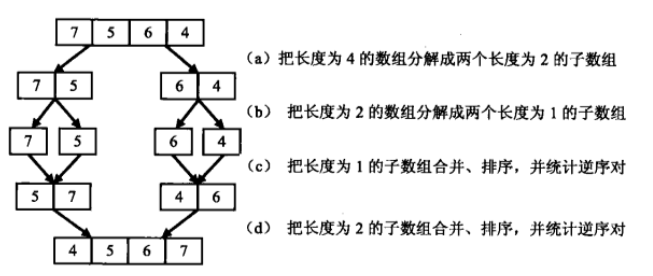
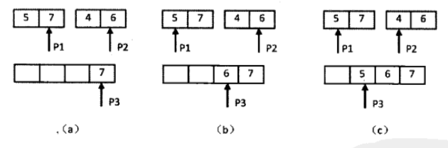
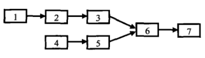

# 第 10 篇

## 丑数

### 问题
把只包含因子2、3和5的数称作丑数（Ugly Number）。例如6、8都是丑数，但14不是，因为它包含因子7。 习惯上我们把1当做是第一个丑数。求按从小到大的顺序的第N个丑数。

### 思路
首先明确一下丑数的定义：只包含银子2，3和5的数。所以要判断一个数是否是丑数，可以先用它使劲除以2（如果它%2为0，则把它除以2，循环判断和除），使劲除以3，使劲除以5，这一套下来如果最后只剩1，说明它是丑数。

既然能够判断丑数，最笨的方法就是从1开始挨个往后找，直到找到第N个丑数。缺点：每个数都判断了一次，但是有的数肯定不是丑数，还是花费大量时间去判断了。

根据定义，除了1之外，丑数应当是另一个丑数乘以2或3或5的结果，所以可以保存之前已求出的丑数，用来生成后续的丑数。

理一下思路。有一个数组，按大小存放当前已经找到的丑数。假设当前数组中最大的丑数是M。要找一个新的丑数，肯定是根据列表中当前的数x2/3/5生成出来的。把每个丑数乘以2，然后选第一个大于M的；把每个乘以3，然后选第一个大于M的；把每个乘以5，然后选第一个大于M的。从这三个结果中，选出最小的那个，就是下一个找到的丑数。

由于列表有序，不必从头把每个数乘以2，只要记下第一个乘以2之后大于M的位置即可，后面再找，可以从该位置继续往后找。所以可以弄3个标记指针，以代表x2的指针为例，x2指针指向当前第一个x2之后大于M的数，同理x3和x5指针也是。


### 代码
自己写的笨代码：
```python
    def GetUglyNumber_Solution(self, index):
        if index < 7:
            return index
        numbers = [1,]
        two = 0
        three = 0
        five = 0
        while(len(numbers) < index):
            while two < len(numbers):
                cur_two = numbers[two] * 2 
                if cur_two <= numbers[-1]:
                    two += 1
                else:
                    break
            while three < len(numbers):
                cur_three = numbers[three] * 3
                if cur_three <= numbers[-1]:
                    three += 1
                else:
                    break
            while five < len(numbers):
                cur_five = numbers[five] * 5
                if cur_five <= numbers[-1]:
                    five += 1
                else:
                    break
            numbers.append(min(cur_two, cur_three, cur_five))
        return numbers[-1]
```

更加简洁的代码：
```python
if index < 7:
        return index
    result = [1,]
    two = 0
    three = 0
    five = 0
    while len(result) < index:
        result.append(min(result[two]*2, result[three]*3, result[five]*5))
        if result[-1] == result[two] * 2:
            two += 1
        if result[-1] == result[three] * 3:
            three += 1
        if result[-1] == result[five] * 5:
            five += 1
    return result[-1]
```

## 第一个只出现一次的字符

### 问题
在一个字符串(1<=字符串长度<=10000，全部由字母组成)中找到第一个只出现一次的字符,并返回它的位置

### 思路
最笨的办法，从头开始，对每个字符，都把整个字符串扫一遍看看是不是只出现一次，找到第一个即停止。时间复杂度是O(n^2)，肯定会有更好的方法。

另一种思路是，开一块额外空间做一个出现次数的计数，对这个串扫一遍就能得到各个字符的出现次数了，计数可以通过哈希表来实现（如Python中的字典就是哈希表来实现的）。然后需要找到第一个只出现一次的字符，这就要求字典中key的顺序应当是字符在串中出现的先后顺序，但是哈希表的key是无序的…… 一种可行的做法是，再扫一遍整个串，扫到每个字符时查一下该字符的计数，找到第一个计数为1的就可以了。总共只需要扫两边字符串，但需要开辟额外的一些空间来做计数。

哈希表的实现，可以直接用Python的字典，也可以自己来实现一个。由于这里的字符只是英文字母，因此可以用0-255的ASCII码作为键，开辟一个256长度的数组，用很少的空间实现了哈希表。

### 代码
```python
class Solution:
    def FirstNotRepeatingChar(self, s):
        if not s:
            return -1
        dic = {}
        for char in s:
            if char in dic:
                dic[char] += 1
            else:
                dic[char] = 1
        # 最近新了解到的做法，Python在for in中可以这样获取到当前下标，而不用自己建一个计数器了
        for index, char in enumerate(s):
            if dic[char] == 1:
                return index
```
提示：Python中获取一个字符的整数型编码，可以用 ord() 函数，例如 ord('中')=20013， ord('A')=65 。

### 扩展

一些类似解决方法的问题：

（1）有两个字符串，从第一个字符串中删除在第二个字符串中出现过的字符。
构建一个哈希表，把第二个中出现过的字符设置为1，那么只需把第一个字符串扫一遍，每个字符去表里查一查，如果为1说明在第二个串中出现过，则删除。

（2）删除字符串中重复出现的字符，例如 google 删除后剩下 gole
构建一个哈希表，只需把字符串扫一遍。扫到某个字符时，先去表里查，如果位置为0，没出现过，则把其位置设置为1，如果位置为1，则从串里删掉此字符

（3）变位词问题，英语中如果两个单词中出现的字母相同，且每个字母出现的次数也相同，则互为变位词。例如 evil和live。判断是否互为变位词。
构建哈希表，把第一个单词扫一遍，扫到每个字母时其次数+1。把第二个单词扫一遍，扫到每个字母时其次数-1。最后把哈希表的值检查一遍，如果所有位置都是0，则说明是变位词。


## 数组中的逆序对

### 问题
在数组中的两个数字，如果前面一个数字大于后面的数字，则这两个数字组成一个逆序对。输入一个数组,求出这个数组中的逆序对的总数P。

### 思路
直观思路就是从头开始逐个数字处理，读到一个数字就把它和它之后的进行比较，以O(n^2)时间复杂度解决。

另一种可行的思路是，分解来处理。以 7564 为例，按下图所示先逐次两半拆分，然后进行合并和计数。



例如将7和5合并，读到有1个逆序对，然后75要排序一下以免后续重复统计；将57和46合并时，按照下面的流程来计数：



两个指针分别指向两个数组末尾，并比较大小，如果当前指向的第一个子数组中的数字大于第二个子数组中当前指向的数字，则构成逆序对（说明第一个中的当前指针处最大数大于第二个中的当前指针处最大数，逆序对个数为第二个子数组中剩余数字的个数）。如果小于等于，则不构成逆序对。然后将较大的数字复制到辅助数组中，并将指针往前挪一位。依此类推。

总结一下过程：先拆分成子数组，统计子数组内部的逆序对，然后统计两个相邻子数组之间逆序对的数目。


### 代码
用Python在牛客上超时了没通过（笑哭）
```python
# -*- coding:utf-8 -*-
class Solution:
    def InversePairs(self, data):
        # write code here
        if not data:
            return 0
        copy = [ x for x in data ]
        # 调用递归
        count = self.Func(data, copy, 0, len(copy)-1)
        return count % 1000000007
    
    def Func(self, data, copy, start, end):
        if start == end:
            copy[start] = data[start]
            return 0
        length = (end - start) // 2
        # 先将整个数据拆分成左右两半子数组，递归去先处理子数组
        left = self.Func(data, copy, start, start+length)
        right = self.Func(data,copy, start+length+1, end)
        
        # 子数组处理完成后回到这一层，处理两个子数组的合并
        # 两个指针指向两个子数组的末尾
        i = start + length
        j = end
        indexCopy = end
        count = 0
        # while都未读完
        while(i>=start and j>=start+length+1):
        	# 左比右大，说明产生多个逆序对，个数为右边余下的数字个数
            if data[i] > data[j]:
                copy[indexCopy] = data[i]
                indexCopy -= 1
                i -= 1
                count += j-start-length
            else:
            	# 左小于或等于右，则没有逆序对
                copy[indexCopy] = data[j]
                indexCopy -= 1
                j -= 1
        
        # 说明左边有剩余，将余下的追加到合并后的数组里
        while i>=start:
            copy[indexCopy] = data[i]
            indexCopy -= 1
            i -= 1
        # 说明右边有剩余，将余下的追加到合并后的数组里
        while j>=start+length+1:
            copy[indexCopy] = data[j]
            indexCopy -= 1
            j -= 1
        # 返回的个数为左右子数组各自的逆序对个数，和这一层的逆序对个数
        return left + right + count
```


## 两个链表的第一个公共结点

### 问题
输入两个链表，找出它们的第一个公共结点。

注意：题目所指的公共结点，并不是仅仅值相同的两个不同结点，而是说地址也相同的同一个结点，即这个结点同时位于两个链表中。

### 思路
最直接的蛮力法，遍历第一个链表，每个结点，都把第二个扫一遍，找到公共结点。复杂度O(mn)。



根据公共结点的定义，分析可以知道，两个链表其实是如图所示的这种情况，也就是说，从第一个公共结点开始，之后的结点都是公共结点。

那么就有一些思路啦。
（1）从后往前找。借助辅助空间，将两个链表的结点放入两个栈里，然后比较栈顶元素，如果相同则弹出，直到找到最后一个相同的结点，就是第一个公共结点。
时间复杂度O(m+n)，额外需要空间也是O(m+n)

（2）另一种思路是，首先两个各遍历一遍，得到两个链表的长度。计算长度差，让长的先走一段，走到两个链表余下长度相同时，两个链表同时继续走，并比较元素，就能找到第一个相同元素。

第二种思路比第一种思路要好一些，因为不需要额外的空间了，而且只需遍历两个链表两遍，和第一种的时间复杂度一样。

### 代码
```python
# -*- coding:utf-8 -*-
# class ListNode:
#     def __init__(self, x):
#         self.val = x
#         self.next = None
class Solution:
    def FindFirstCommonNode(self, pHead1, pHead2):
        if not pHead1 or not pHead2:
            return None
        len1 = 0
        len2 = 0
        ptr1 = pHead1
        ptr2 = pHead2
        while ptr1:
            len1 += 1
            ptr1 = ptr1.next
        while ptr2:
            len2 += 1
            ptr2 = ptr2.next
        ptr1 = pHead1
        ptr2 = pHead2
        while len1 > len2:
            ptr1 = ptr1.next
            len1 -= 1
        while len2 > len1:
            ptr2 = ptr2.next
            len2 -= 1
        while len1 > 0:
            if id(ptr1) == id(ptr2):
                return ptr1
            else:
                ptr1 = ptr1.next
                ptr2 = ptr2.next
                len1 -= 1
```


------

本文稿来自 https://github.com/dox1994/offer-coding-interviews-python，欢迎前来给个star🌟～ 如有错误或遗漏欢迎issue～