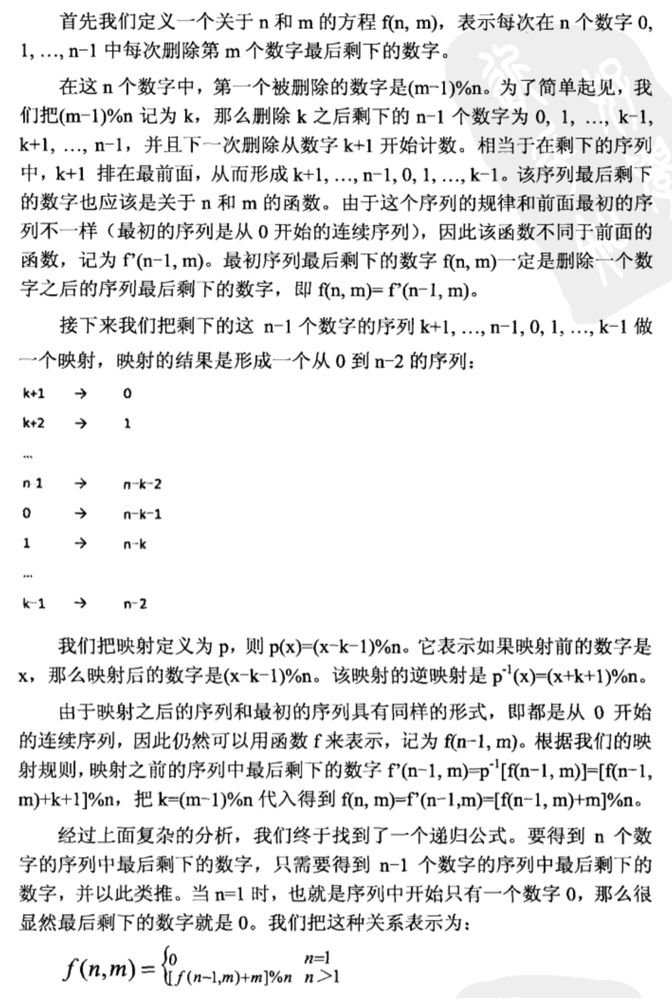

# 第 12 篇

## 翻转单词顺序
### 问题
输入一个英文句子，翻转句子中单词的顺序，而单词中的字母顺序不变。例如，“student. a am I” 应该是“I am a student.”（标点也当作字母来处理，和它前面的单词作为一个整体）

### 思路
写一个字符串数组翻转函数，第一遍先把整个句子按字母翻转一遍，得到 I ma a .tneduts，第二遍再以空格为分隔，对每个单词运行一遍翻转，得到 I am a student. ，还是很基础的感觉。

### 代码
先来个python偷懒的写法，一行搞定：
```python
# -*- coding:utf-8 -*-
class Solution:
    def ReverseSentence(self, s):
        return ' '.join(s.split(' ')[::-1]) if s.strip() else s
		# strip的目的是防止输入全是空格导致输出为空
```

回归老实点的写法：
```
# -*- coding:utf-8 -*-
class Solution:
    def ReverseSentence(self, s):
        if not s:
            return ""
        s = list(s)
        # 第一步，翻转整个数组
        s = self.reverse_array(s, 0, len(s)-1)
        end = 0
        # 第二步，翻转各个单词
        while end < len(s):
            if s[end] == ' ':
                end += 1
            else:
                start = end
                while end < len(s) and s[end] != ' ':
                    end += 1
                s = self.reverse_array(s, start, end-1)
        return ''.join(s)

    def reverse_array(self, array, start, end):
        print(start, end)
        while start < end:
            array[start], array[end] = array[end], array[start]
            start += 1
            end -= 1
        return array
```

## 左旋转字符串

### 问题
字符序列S=”abcXYZdef”,要求输出循环左移3位后的结果，即“XYZdefabc”。

### 思路
可以把字符串切分成几块，重新排序一下输出就行；另一种做法是，这个问题类比成单词翻转，abc是一个单词，xyzdef是一个单词，先分别翻转这两块，再整个串翻转（主要体现了迁移能力）

### 代码
先来python的蒂花之秀系列：
```python
class Solution:
    def LeftRotateString(self, s, n):
        return s[n:] + s[:n]
```

用多次翻转的方式来写：
```python
# -*- coding:utf-8 -*-
class Solution:
    def LeftRotateString(self, s, n):
        if not s:
            return ''
        s = list(s)
        s = self.reverse_array(s, 0, n-1)
        s = self.reverse_array(s, n, len(s)-1)
        s = self.reverse_array(s, 0, len(s)-1)
        return ''.join(s)
    
    def reverse_array(self, array, start, end):
        print(start, end)
        while start < end:
            array[start], array[end] = array[end], array[start]
            start += 1
            end -= 1
        return array
```

## n个骰子的点数
### 问题
n个骰子扔地上，所有骰子朝上一面的点数之和为s，输入n，打印出s的所有可能值出现的概率。

### 思路
穷举的话，共有 6^n 种可能的结果，对每一种算出和s（s的范围肯定在n到6n之间），统计每个s值出现的次数除以 6^n 即可，效率很低，因为固定外层的点数1-6每次内层都要循环一遍，感觉有蛮多重复的。

另一思路是，假设有一个数组A，第n位置记录了当前和为n出现的次数，假设A目前只记录了第一个骰子的结果，也就是1-6位置的值各为1，那么现在加入下一个骰子，下一个骰子的值取1-6，那么对数组的修改就是，新的数组B的第n个位置的出现次数，应当是数组A的n-1，n-2，n-3，n-4，n-5，n-6位置的次数的和（对应于当前骰子掷出1-6点的情况），所以按此规则根据A来得到数组B。再加入一个骰子，依然是可以根据B得出新的C，直到加满全部六个骰子。（实际工程中可以复用AB两个数组轮番交替）

### 代码
穷举实现的话，可以用递归的方式，第一层先固定第一个骰子的点数分别为1-6，然后传入更深一层的去计算剩余5个的情况，依此类推。用一个全局的数组（长为6n-n+1）记录各个和出现的次数，最后去除以 6^n 来得到概率。

针对上面的思路2，写代码：
```python
def prob(n):
    if n <= 0:
        return 0
	# 没有把骰子最大点数写死
    max_num = 6
    prob = [[0, ] * (max_num * n + 1)] * 2
    # flag 标记当前使用哪个累计数组
    flag = 0
    # 先把第一个骰子的情况写入
    for i in range(1, max_num + 1):
        prob[flag][i] = 1
    # 后面每个骰子
    for i in range(2, n+1):
        # 清空数组
        prob[1-flag] = [0, ] * (max_num * n + 1)
        # 对第i个骰子，其和的范围必定是从 i 到 max_num * i，只需计算这个范围即可
        for j in range(i, max_num * i + 1):
            if j - max_num > 0:
                prob[1-flag][j] = sum(prob[flag][j-max_num:j])
            else:
                prob[1-flag][j] = sum(prob[flag][:j])
        flag = 1 - flag
    print(prob[flag])
	
	# 例如，prob（3）输出
	# [0, 0, 0, 1, 3, 6, 10, 15, 21, 25, 27, 27, 25, 21, 15, 10, 6, 3, 1]
```

## 扑克牌顺子
### 问题
扑克牌中，大\小王可以看成任何数字,并且A看作1,J为11,Q为12,K为13，抽五张牌判断是否为顺子。 例如抽到 [大王, 1,3,4,5] 就是顺子。

### 思路
思路就是，大小王可以视作0，然后把数组排序。从头开始读数组，统计0的个数，然后读后面的数字，相邻两个数字之间如有间隔差值，则用0的个数来填补，如果后面的数字本来就是连续的则肯定ok，如果中间有不连续且刚好能被0填补，则也是顺子。

另外注意一点，相邻两个数字之间差值如果为0，也是不连续的，这种情况不能用0来填补，直接返回不连续。

### 代码
```python
# -*- coding:utf-8 -*-
class Solution:
    def IsContinuous(self, numbers):
        if not numbers:
            return False
        numbers.sort()
        num_of_0 = 0
        for i in range(0, len(numbers)-1):
            if numbers[i] == 0:
                num_of_0 += 1
            else:
                delta = numbers[i+1] - numbers[i]
                if delta < 1:
                    return False
                elif delta > 1:
                    num_of_0 -= (delta - 1)
                    if num_of_0 < 0:
                        return False
        return True
```

## 圆圈中最后剩下的数字
### 问题
0,1,2.....,n-1 这n个数字排成一圈，从0开始每次删除第m个数字，求剩下的最后一个数字。

例如，0,1,2,3,4这5个数字，如果m=3，则依此删除的是 2, 0, 4, 1, 3，最后剩下的是3.

### 思路
本题是有名的约瑟夫(Josephuse)环问题。

解法一，模拟环的样子。使用环形链表，或者单链表加重置到头部的方式，来模拟这个圆圈，然后就按照题中所述操作删除元素，直到最后剩下一个。缺点是，要多开辟链表的空间O(n)，还要把链表走很多圈，时间复杂度O(mn)。这种思路容易想到，但是代码实现上稍微要多写一点，而且效率略微有点低。

另一种解法，寻找规律，找到一个递推公式，从而快速完成计算。


### 代码
这个代码写得还不错（至少时间只要几十ms，比我运行了600ms的要好很多……）
```python
# -*- coding:utf-8 -*-
class Solution:
    def LastRemaining_Solution(self, n, m):
        # write code here
        if n < 1:
            return -1
        con = range(n)
        final = -1
        start = 0
        while con:
            k = (start + m - 1) % n
            final = con.pop(k)
            n -= 1
            start = k
        return final
```

## 求 1 + 2 + 3 + ... + n 
### 问题
求1+2+3+...+n，要求不能使用乘除法、for、while、if、else、switch、case等关键字及条件判断语句（A?B:C）。

### 思路
严苛的限制条件导致立马想到的思路都不能用了：直接公式求，必须用到乘法；循环要用到while或for；递归需要用到if来判断何时停止。

**短路原理+递归**
递归，但利用短路原理来作为递归终止的条件。当&&先左半边判断ans为0后，右边就不执行了，实现了递归的终止
```c++
class Solution {
public:
    int Sum_Solution(int n) {
        int ans = n;
        ans && (ans += Sum_Solution(n - 1));
        return ans;
    }
};
```
注意 python 的写法。当and和or等短路运算符，用作普通值而不是布尔值时，短路运算符的返回值是最后一次评估的参数。也就是说下面的句子中，如果ans为0，则temp为0， 如果ans不为0， 则temp就是递归了之后的值。

```python
# -*- coding:utf-8 -*-
class Solution:
    def Sum_Solution(self, n):
        ans = n
        temp = ans and self.Sum_Solution(n-1)
        ans = ans + temp
        return ans
```

剑指offer书里面写的几种方法，大多和c++的语言特性本身有关了，不太很通用就不看了吧。


## 不用加减乘除做加法
### 问题
写一个函数，求两个整数之和，要求在函数体内不得使用+、-、*、/ 四则运算符号。

### 思路
通过位运算的方法：

首先看十进制是如何做的： 5+7=12，三步走
第一步：相加各位的值，不算进位，得到2。
第二步：计算进位值，得到10. 如果这一步的进位值为0，那么第一步得到的值就是最终结果。
第三步：重复上述两步，只是相加的值变成上述两步的得到的结果2和10，得到12。

同样我们可以用三步走的方式计算二进制值相加： 5-101，7-111

第一步：相加各位的值，不算进位，得到010，二进制每位相加就相当于各位做异或操作，101^111。

第二步：计算进位值，得到1010，相当于各位做与操作得到101，再向左移一位得到1010，(101&111) << 1。

第三步重复上述两步， 各位相加 010^1010=1000，进位值为100=(010&1010) << 1。     继续重复上述两步：1000^100 = 1100，进位值为0，跳出循环，1100为最终结果。

### 代码

```java
public class Solution {
    public int Add(int num1,int num2) {
        while (num2!=0) {
            int temp = num1^num2;
            num2 = (num1&num2)<<1;
            num1 = temp;
        }
        return num1;
    }
}
```
拿python刷题的遇到位运算基本感觉要哭晕在厕所……
```python
# -*- coding:utf-8 -*-
class Solution:
    def Add(self, a, b):
        while(b):
            a, b = (a^b) & 0xFFFFFFFF,((a&b)<<1) & 0xFFFFFFFF
        return a if a<=0x7FFFFFFF else ~(a^0xFFFFFFFF)
```
补充一下python位运算：
```python
x >> y # 返回 x 向右移 y 位得到的结果
x << y # 返回 x 向左移 y 位得到的结果
x & y # 与操作，xy对应的每一位，只有都为1时才为1
x | y # 或操作，xy对应的每一位，只有都为0时才为0
~x # 按位取反操作，x的每一位如果为0则变为1，如果为1则变为0，从十进制来看，结果是 -x - 1（例如，~8 = -9）
x ^ y # 异或运算，xy对应的每一位，数字不同则为1，数字相同则为0
```


------

本文稿来自 https://github.com/dox1994/offer-coding-interviews-python，欢迎前来给个star🌟～ 如有错误或遗漏欢迎issue～