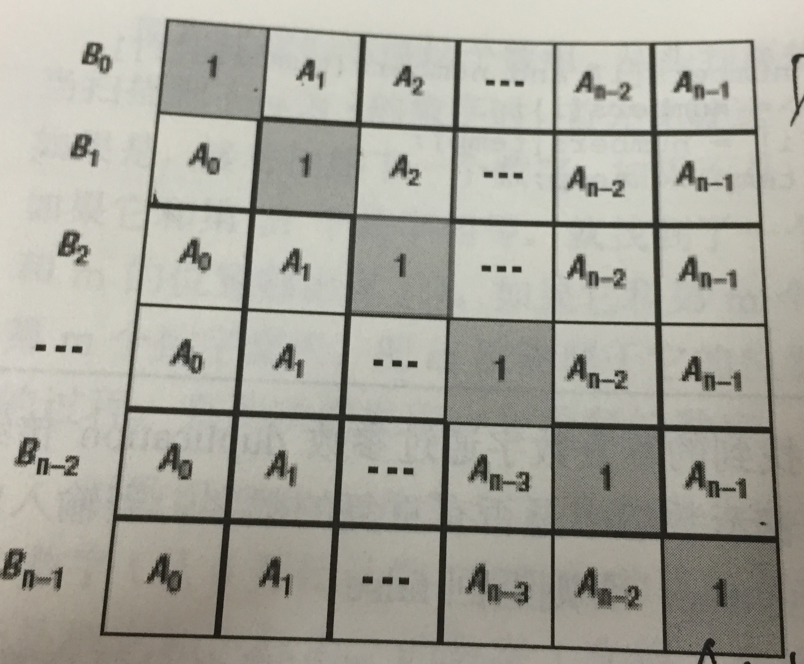
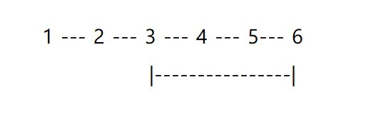

# 第 13 篇

## 把字符串转换成整数

### 问题
将一个字符串转换成一个整数(实现Integer.valueOf(string)的功能，但是string不符合数字要求时返回0)，要求不能使用字符串转换整数的库函数。 数值为0或者字符串不是一个合法的数值则返回0。

### 思路
逐个位来判断和累加计算就行，但需要注意各种各样的特殊情况要考虑周全。
比如，以+ - 开头的、字符串不能出现字母等其他符号、+-不能出现在中间，以及空字符串、只有+-字符的字符串等。

### 代码
```python
# -*- coding:utf-8 -*-
class Solution:
    def StrToInt(self, s):
        # write code here
        minus = 1
        number = 0
        if not s:
            return number
        if s[0] == '+':
            if len(s) > 1:
                s = s[1:]
            else:
                return 0
        elif s[0] == '-':
            minus = -1
            if len(s) > 1:
                s = s[1:]
            else:
                return 0
        for i in range(0, len(s)):
            if '0' <= s[i] <= '9':
                number = number * 10 + ord(s[i]) - ord('0')
            else:
                return 0
        return number * minus
```

## 数组中重复的数字

### 问题
在一个长度为n的数组里的所有数字都在0到n-1的范围内。 数组中某些数字是重复的，但不知道有几个数字是重复的。也不知道每个数字重复几次。请找出数组中任意一个重复的数字。 例如，如果输入长度为7的数组{2,3,1,0,2,5,3}，那么对应的输出是第一个重复的数字2。

### 思路
基本的思路就是建一个hash表，读数先判断是否重复，不重复就放进去读下一个，直到找到第一个重复的。

另外可以进行排序，然后判断是否有相邻两个数重复。

但注意题目中条件，所有数字都在0到n-1范围内。因此无需开辟额外空间，可以直接在数组上做标记。读到数字时，将数组中该数字作为下标的位置的数字，减去n，作为标记。下次读到相同数字，去其下标位置，发现数字值小于0，说明已经被标记过，那么这个就是重复数字了。

一些细节：之所以不用加上n的方法来标记，是因为可能会导致数字过大溢出（减去n就不会，因为只要n不溢出， -n-1 就不溢出， -n-1+一个正数 就也不会溢出）。也不能乘以-1来做标记，因为这种方法对0就没法做标记了。

### 代码
```python
# -*- coding:utf-8 -*-
class Solution:
    # 返回值格式：函数返回True/False，找到任意重复的一个值并赋值到duplication[0]
    def duplicate(self, numbers, duplication):
        length = len(numbers)
        for num in numbers:
            if num >= 0:
                # 直接按num为下标去找
                index = num
            else:
                # 如果此处已被标记，则下标要按此处的值 num+length 去找
                index = num + length
            if numbers[index] < 0:
                # 找到重复
                duplication[0] = numbers[index] + length
                return True
            else:
                # 不重复，则做下标记
                numbers[index] -= length
        return False
```

## 构建乘积数组
### 问题
给定一个数组A[0,1,...,n-1],请构建一个数组B[0,1,...,n-1],其中B中的元素B[i]=A[0]*A[1]*...*A[i-1]*A[i+1]*...*A[n-1]。不能使用除法。

### 思路
如果可以使用除法，则先求出A所有元素的积，再依此对每个位置做除法就行（注意考虑到0的情况！）

让我们以一种清楚点的方式来看这个题，其实对B的每一个元素，都可以以下标i，把整个乘积分为前后两个部分：



具体到实现上，可以先做左下部分，即做一个循环，从上往下，B中当前元素的值，是A中对应的一个值和前一个B的值相乘得到。然后再对右上部分做一个循环，此时就要单独开辟一个temp来存储累乘值，从下往上把右上部分的值补全。

### 代码
```
# -*- coding:utf-8 -*-
class Solution:
    def multiply(self, A):
        if not A:
            return []
        B = [1] * len(A)
		# 先从上往下累乘左下半
        for i in range(1, len(A)):
			# 无需额外开辟temp存储累乘值，因为累乘值就是B[i-1]
            B[i] = B[i-1] * A[i-1]
		# 再从下往上累乘右上半
        temp = 1  # 需要额外开辟temp来存储累乘值了
        for i in range(len(A)-2, -1, -1):
            temp *= A[i+1]
            B[i] *= temp
        return B
```

## 正则表达式匹配
### 问题
请实现一个函数用来匹配包括'.'和'*'的正则表达式。模式中的字符'.'表示任意一个字符，而'*'表示它前面的字符可以出现任意次（包含0次）。 在本题中，匹配是指字符串的所有字符匹配整个模式。例如，字符串"aaa"与模式"a.a"和"ab*ac*a"匹配，但是与"aa.a"和"ab*a"均不匹配

### 思路
重点是要思路清晰吧……只能说很容易就忽略各种各样的情况，导致无法通过所有用例。

对初始输入的判断：
如果s和pattern都为空，则True；如果s不空，而pattern为空，则直接False.

然后来读取pattern中的每个字符：
- 如果当前pattern字符的后面不是\* ，则说明只可匹配1个
	- 如果当前pattern字符是\.的话，可匹配1个任意字符
	- 如果不是点，则只能匹配给出的字符，若不匹配则直接返回
	- 完成后两者均往后+1，继续判断
- 如果当前pattern字符的后面是\* ，说明当前pattern字符可匹配0-任意多个。
	- 如果当前pattern字符与串的字符不一致，而且当前字符不是点，则当作是 * 的不匹配情况，pattern往后+2而字符串不变
	- 否则其他情况：
		- 要么共匹配0个，pattern往后+2，字符串不变
		- 要么共匹配1个，字符串往后+1, pattern 往后+2
		- 要么先匹配1个，留待继续匹配，此时字符串+1， pattern不变
		- 然后继续匹配后面的是否match；

### 代码
```python
# -*- coding:utf-8 -*-
class Solution:
    # s, pattern都是字符串
    def match(self, s, pattern):
        # 如果s与pattern都为空，则True
        if len(s) == 0 and len(pattern) == 0:
            return True
        # 如果s不为空，而pattern为空，则False
        elif len(s) != 0 and len(pattern) == 0:
            return False
        # 如果s为空，而pattern不为空，则需要判断
        elif len(s) == 0 and len(pattern) != 0:
            # pattern中的第二个字符为*，则pattern后移两位继续比较
            if len(pattern) > 1 and pattern[1] == '*':
                return self.match(s, pattern[2:])
            else:
                return False
        # s与pattern都不为空的情况
        else:
            # pattern的第二个字符为*的情况
            if len(pattern) > 1 and pattern[1] == '*':
                # s与pattern的第一个元素不同，则s不变，pattern后移两位，相当于pattern前两位当成空
                if s[0] != pattern[0] and pattern[0] != '.':
                    return self.match(s, pattern[2:])
                else:
                    # 如果s[0]与pattern[0]相同，且pattern[1]为*，这个时候有三种情况
                    # pattern后移2个，s不变；相当于把pattern前两位当成空，匹配后面的
                    # pattern后移2个，s后移1个；相当于pattern前两位与s[0]匹配
                    # pattern不变，s后移1个；相当于pattern前两位，与s中的多位进行匹配，因为*可以匹配多位
                    return self.match(s, pattern[2:]) or self.match(s[1:], pattern[2:]) or self.match(s[1:], pattern)
            # pattern第二个字符不为*的情况
            else:
                if s[0] == pattern[0] or pattern[0] == '.':
                    return self.match(s[1:], pattern[1:])
                else:
                    return False
```

## 表示数值的字符串
### 问题
请实现一个函数用来判断字符串是否表示数值（包括整数和小数）。例如，字符串"+100","5e2","-123","3.1416"和"-1E-16"都表示数值。 但是"12e","1a3.14","1.2.3","+-5"和"12e+4.3"都不是。

### 思路
以下为剑指Offer上的思路：
表示数值的字符串遵循模式 `A[.[B]][e|EC]` 或者 `.B[e|EC]`。其中，A为数值的整数部分，B为小数部分，C为指数部分。要满足以下条件：
- 可以没有A部分，或者没有B部分，但不能AB同时没有
- AC均可能以+-开头的0-9字符
- B也是0-9字符但不能有+-号

判断时，从左到右扫描字符串，先尽可能地扫描出整数部分A，碰到小数点再扫描得到B，碰到e或E再扫描得到C。

### 代码

按剑指 Offer 上的思路，来写代码如下：
```python
# -*- coding:utf-8 -*-
class Solution:
    def __init__(self):
        self.cursor = 0

    def isNumeric(self, s):
        if not s:
            return False
        # 先判断是否存在A部分
        numeric = self.scan_integer(s)
        # 如果出现小数点，则判断小数部分
        if (self.cursor < len(s)) and s[self.cursor] == '.':
            self.cursor += 1
            # 用or的原因是，既可以没有A部分，也可以没有B部分，也可以AB都有，但不能AB都没有
            numeric = self.scan_unsigned_integer(s) or numeric
        # 如果出现e，则判断指数部分
        if (self.cursor < len(s)) and (s[self.cursor] == 'e' or s[self.cursor] == 'E'):
            self.cursor += 1
            # 用and的原因是，既然出现了E，后面必须要有整数，且E的前面必须是已判断好了的合法数字
            numeric = numeric and self.scan_integer(s)
        
        return numeric and self.cursor == len(s)
            
        
    def scan_integer(self, s):
        # 作用：扫描字符串从当前cursor位置往后，是否有整数
        # 先处理掉前面的符号位（如果没有符号位就不处理，无影响）
        if (self.cursor < len(s)) and (s[self.cursor] == '+' or s[self.cursor] == '-'):
            self.cursor += 1
        # 再调用判断无符号整数的方法
        return self.scan_unsigned_integer(s)
    
    def scan_unsigned_integer(self, s):
        # 作用：扫描字符串从当前cursor位置往后，是否有无符号整数
        # 先记下cursor本来的位置
        original_cursor = self.cursor
        # 遇到 0-9 数字就往后移动cursor
        while (self.cursor < len(s)) and ('0' <= s[self.cursor] <= '9'):
            self.cursor += 1
        # 如果cursor比最初后移了，说明有无符号整数
        return self.cursor > original_cursor
```

另有思路，用有限自动机来实现，这个感觉是挺好的，而且具有扎实的计算机基础，判断过程也会更严谨。 具体见 https://www.nowcoder.com/questionTerminal/6f8c901d091949a5837e24bb82a731f2


此外，再贴牛客上的一个实现思路：
```python
# -*- coding:utf-8 -*-
class Solution:
    # s字符串
    def isNumeric(self, s):
        # 标记符号、小数点、e是否出现过
        sign = False
        decimal = False
        has_e = False
        for i in range(len(s)):
            if s[i] == 'e' or s[i] == 'E':
                if i == len(s) - 1:
                    return False  # E后面必须跟数字，E不可以在字符串结尾
                if has_e:
                    return False  # 不可以出现两个E
                has_e = True
            elif s[i] == '+' or s[i] == '-':
                if sign and (s[i-1] != 'e' and s[i-1] != 'E'):
                    return False  # 如果是第二次出现符号，符号必须跟在E之后
                if (not sign) and (i > 0) and (s[i-1] != 'e' and s[i-1] != 'E'):
                    return False  # 如果第一次出现符号，且不是在开头出现，则必须紧跟在E之后
                sign = True
            elif s[i] == '.':
                if has_e or decimal:
                    return False  # E后面不能出现小数点，或小数点不能出现两次
                decimal = True
            elif s[i] < '0' or s[i] > '9':
                return False  # 不合法字符
        return True
```

## 第一个只出现一次的字符

### 问题
请实现一个函数用来找出字符流中第一个只出现一次的字符。例如，当从字符流中只读出前两个字符"go"时，第一个只出现一次的字符是"g"。当从该字符流中读出前六个字符“google"时，第一个只出现一次的字符是"l"。

如果当前字符流没有存在出现一次的字符，返回#字符。

（注：本题就是求字符串中第一个只出现一次的字符，但是把具体代码实现稍微做了变化，也即模拟了一个字符流，需要通过insert函数每次插入一个字符，然后通过 fisrt_appear_once获取当前状态下的字符串里的第一个只出现一次的字符）

### 思路
（刷题后遗症就是这道题明明觉得有好多种方法可以实现，但还是怀疑自己没有想到最优的方法，也是醉了……）

最基本的方法就是，从当前串开头开始读，读到每个字符就往后扫一遍看是否有重样的， 直到找到第一个不重样的。时间复杂度n^2。

另外方法自然就是建hash表啦，先扫一遍串，记下每个字符出现的次数，再扫一遍串同时查询每个字符出现的次数，遇到出现次数为1的就是第一个只出现一次的字符了。

### 代码
```python
# -*- coding:utf-8 -*-
class Solution:
    def __init__(self):
        self.stream = []
        self.counter = {}
    # 返回对应char
    def FirstAppearingOnce(self):
        for c in self.stream:
            if self.counter[c] == 1:
                return c
        return '#'
        
    def Insert(self, char):
        if char in self.counter:
            self.counter[char] += 1
        else:
            self.counter[char] = 1
        self.stream.append(char)
```

## 链表中环的入口结点

### 问题
给一个链表，若其中包含环，请找出该链表的环的入口结点，否则，输出null。

### 思路

首先要确定是否包含环。（这个题在第二版书中是位于 链表倒数第k个结点 之后的，所以思路上会有些类似。）确定的方法是，两个指针同时从头出发，一个一次走一步，一个一次走两步，当快指针和慢指针重逢了，说明存在环，如果快指针走到了链表末尾，也没有和慢的重逢过，说明不包含环。

第二步是找出环的入口。仍然可以用两个指针，如图的环有4个节点，那么让p1先走4步，然后p1 p2 一起走，当两个指针重逢时，由于两个指针差距应该是环的长度，而他俩重逢了，说明p1已经绕环走了一圈，重逢的位置就是环的入口。

如何找到环的长度？在前面判断是否有环时，如果快慢指针相遇则说明有环，此时相遇的节点必定在环中，记住这个节点然后从它出发，等再次回到这个节点时就走了一圈，就得到环的长度了。

所以这个题的关键在于，要知道如何判断是否包含环、如何计算环长度、如何通过两个指针差距的方法找到环的入口。

### 代码
```python
# -*- coding:utf-8 -*-
# class ListNode:
#     def __init__(self, x):
#         self.val = x
#         self.next = None
class Solution:
    def EntryNodeOfLoop(self, pHead):
        if not pHead:
            return None
        fast = pHead
        slow = pHead
        has_loop = False
        # 先判断是否有环
        while fast:
            if fast.next:
                fast = fast.next.next
            else:  # fast已经走到最后的节点了
                return None
            slow = slow.next
            if fast == slow:
                has_loop = True
                break
        if not has_loop:
            return None
        # 统计环中节点个数
        count = 1
        fast = fast.next
        while slow != fast:
            fast = fast.next
            count += 1
        # 寻找环的入口
        fast = pHead
        slow = pHead
        while count > 0:
            fast = fast.next
            count -= 1
        while fast != slow:
            fast = fast.next
            slow = slow.next
        return fast
```

另有一种很简洁的python写法：
```python
class Solution:
    def EntryNodeOfLoop(self, pHead):
        slow, fast = pHead, pHead
        while fast and fast.next:
            slow = slow.next
            fast = fast.next.next
            if slow == fast:  # 有环
                slow2 = pHead  # 直接让slow继续走，另从head同步开始走了？？
                while slow != slow2:
                    slow = slow.next
                    slow2 = slow2.next
                return slow
```

为何判断有环之后，从相遇的点开始，直接让slow和head出发的slow2继续走，等相遇时就是入口了呢？难道不需要先计算一下环长？

不妨这样来算一下，当fast和slow相遇时， l_fast = l_slow + ring = 2 x l_slow，换言之，l_slow = ring ！ 相遇时slow走过的距离，就已经是环的长度了！所以无需再去费劲计算环长，还要让一个指针先走过环长步，因为费了一大圈兜兜转转，最开始相遇的地方，就已经是要找的地方了……

## 删除链表中重复的结点
### 问题
在一个排序的链表中，存在重复的结点，请删除该链表中重复的结点，重复的结点不保留，返回链表头指针。 例如，链表1->2->3->3->4->4->5 处理后为 1->2->5

### 思路
首先构造一个空的头节点（以防出现 1->1 这样的链表，应当返回空），然后有两个指针，pre指向当前已经处理好了的链表，而last指向当前正在处理的节点。

对于每个节点
- 如果它和它后面的值相同，那么就让它一直往后走，直到它和它后面的值不相同，然后把它后面的节点，接到当前处理完链表的后面；
- 如果它和它后面的值不同，就直接接到链表上，然后继续往后找即可

### 代码
```
class Solution:
    def deleteDuplication(self, pHead):
		# 空，或者只有一个节点，直接返回
        if (not pHead) or (not pHead.next):
            return pHead
		# 构造一个新的头节点
        head = ListNode(0)
        head.next = pHead
        pre = head
        last = head.next
        while last:
			# 当前节点有next，且和它的next值相同，说明这一串都要被抛弃
            if last.next and last.val == last.next.val:
                while last.next and last.val == last.next.val:
                    last = last.next
                pre.next = last.next
                last = last.next
			# 当前节点没有next，或者和它的next值不同，则将此节点接入链表，并继续往后走
            else:
                pre = pre.next
                last = last.next
        return head.next
```


