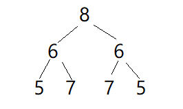

# 第 14 篇

## 二叉树的下一个结点

### 问题
给定一个二叉树和其中的一个结点，请找出中序遍历顺序的下一个结点并且返回。注意，树中的结点不仅包含左右子结点，同时包含指向父结点的指针。

### 思路

以这个图为例来分析一下。

- 如果当前节点有右子树，那么中序的下一个节点就是右子树的最左节点。如图中的b，中序的下一个是h。只需沿着右子树，一直往左下找就行。
- 如果没有右子树
	- 如果它是父节点的左子节点，那么中序的下一个就是它的父节点，如图中的f，下一个是c
	- 如果是父节点的右子节点，就需要往上找父节点，直到找到一个节点x，x是它的父节点的左子节点，这样的话x的父节点就是要找的节点。例如图中i，沿着往上找到b是a的左子节点，那么a就是i中序的下一个。如果找不到，例如图中g，a已经没有父节点，所以g没有下一个中序节点。

### 代码
按照上面思路来写就好，注意不要弄混这些父节点和子节点的关系之类
```python
# -*- coding:utf-8 -*-
# class TreeLinkNode:
#     def __init__(self, x):
#         self.val = x
#         self.left = None
#         self.right = None
#         self.next = None
class Solution:
    def GetNext(self, pNode):
        if not pNode:
            return None
        if pNode.right:
            node = pNode.right
            while node.left:
                node = node.left
            return node
        else:
            if pNode.next and pNode.next.left == pNode:
                return pNode.next
            else:
                node = pNode.next
                while node:
                    if node.next and node.next.left == node:
                        return node.next
                    else:
                        node = node.next
                return node
```

## 对称的二叉树
### 问题
请实现一个函数，用来判断一颗二叉树是不是对称的。注意，如果一个二叉树同此二叉树的镜像是同样的，定义其为对称的。

### 思路

想象一下如果人来做比较，应该如何进行。首先判断根节点的左右，都是6，相等；再判断两个6为根的两棵树，先判断左边的左子树为5，右边的右子树为5，相等；左边没有左子树和右子树了，判断左边的右子树为7，右边的左子树为7，相等；右边也没有左子树和右子树了；……

其实更严格来说，是把根节点的左右两棵树，左边以前序遍历来遍历，右边对应地以一种对称的前序遍历方式，找到和左边对称位置的节点，来比较是否对称。可采用一种递归的方法。

### 代码
```python
# -*- coding:utf-8 -*-
# class TreeNode:
#     def __init__(self, x):
#         self.val = x
#         self.left = None
#         self.right = None
class Solution:
    def isSymmetrical(self, pRoot):
        if not pRoot:
            return True
        else:
            return self.check(pRoot.left, pRoot.right)
    
    def check(self, left, right):
        if (not left) and (not right):
            return True
        elif not(left and right):
            return False
        if left.val != right.val:
            return False
        return self.check(left.left, right.right) and self.check(right.left, left.right)
```

## 按之字形打印二叉树
### 问题
请实现一个函数按照之字形打印二叉树，即第一行按照从左到右的顺序打印，第二层按照从右至左的顺序打印，第三行按照从左到右的顺序打印，其他行以此类推。

### 思路

类似[层级遍历二叉树](https://codingcat.cn/article/26) 的做法，只不过现在需要根据层的奇偶来改变加入的顺序，不能只简简单单用一个队列来解决了。

先来分析一下如图，第0层，先a，然后将a的右c-左b加入下一层；第1层，依次输出c,b，但注意的是却需要先将b的左d-右e加入下一层，才能将c的左f右g加入下一层。也就是说，在这一层时，打印的顺序 和 遍历节点并将节点孩子加入下一层 的顺序，是相反着的。这点特别要注意。

然后就可以循环着来做了，这里使用了两个list交替存储奇数层和偶数层。

### 代码
```
# -*- coding:utf-8 -*-
# class TreeNode:
#     def __init__(self, x):
#         self.val = x
#         self.left = None
#         self.right = None
class Solution:
    def Print(self, pRoot):
        if not pRoot:
            return []
        result = []
        stack = [[pRoot], []]
        current = 0
        while stack[0] or stack[1]:
            if current == 0:
				# 当前偶数下标层，先按list中顺序打印元素
                result.append([p.val for p in stack[0]])
				# 然后逆序遍历，并将每个元素的 右-左 先后加入下一层
                for i in range(len(stack[0])-1, -1, -1):
                    p = stack[0][i]
                    if p.right:
                        stack[1].append(p.right)
                    if p.left:
                        stack[1].append(p.left)
                stack[0] = []
            else:
				# 当前奇数下标层，先按list顺序打印元素
                result.append([p.val for p in stack[1]])
				# 然后逆序遍历，并将每个元素的 左-右 先后加入下一层
                for i in range(len(stack[1])-1, -1, -1):
                    p = stack[1][i]
                    if p.left:
                        stack[0].append(p.left)
                    if p.right:
                        stack[0].append(p.right)
                stack[1] = []
            current = 1 - current
        return result
```

## 把二叉树打印成多行
### 问题
从上到下按层打印二叉树，同一层结点从左至右输出。每一层输出一行。

### 思路与代码
依然是层级遍历，但这次要注意区分每一层，因为需要换行。
我写的思路（插入特殊的节点，作为换行标记）：
```python
# -*- coding:utf-8 -*-
# class TreeNode:
#     def __init__(self, x):
#         self.val = x
#         self.left = None
#         self.right = None
class Solution:
    # 返回二维列表[[1,2],[4,5]]
    def Print(self, pRoot):
        if not pRoot:
            return []
        sep = TreeNode(-1)
        result = []
        queue = [pRoot, sep]
        temp = []
        while queue:
            current = queue.pop(0)
            if current != sep:
                temp.append(current.val)
                if current.left:
                    queue.append(current.left)
                if current.right:
                    queue.append(current.right)
            else:
                result.append(temp)
                temp = []
                if queue:
                    queue.append(sep)
        return result
```

如果不插入特殊标记，其实很简单只需要在每一行开始时计算一下queue的长度，就是这一行的节点数目了。

```python
class Solution:
    # 返回二维列表[[1,2],[4,5]]
    def Print(self, pRoot):
        if not pRoot:
            return []
        result = []
        queue = [pRoot]
        while queue:
            temp = []
            length = len(queue)
            for i in range(length):
                current = queue.pop(0)
                temp.append(current.val)
                if current.left:
                    queue.append(current.left)
                if current.right:
                    queue.append(current.right)
            result.append(temp)
        return result
```

## 序列化二叉树
### 问题
请实现两个函数，分别用来序列化和反序列化二叉树

### 思路
递归前序遍历二叉树，对每个节点的孩子如果遇到空就以#来代替，最终得到一个字符串。
读取字符串，当前字符作为根，下一个字符作为当前的左孩子，依此递归进行前序遍历，恢复树结构。

### 代码
```python
# -*- coding:utf-8 -*-
# class TreeNode:
#     def __init__(self, x):
#         self.val = x
#         self.left = None
#         self.right = None
class Solution:
    def __init__(self):
        self.flag = -1
         
    def Serialize(self, root):
        # write code here
        if not root:
            return '#,'
        return str(root.val)+','+self.Serialize(root.left)+self.Serialize(root.right)
         
    def Deserialize(self, s):
        # write code here
        self.flag += 1
        l = s.split(',')
         
        if self.flag >= len(s):
            return None
        root = None
         
        if l[self.flag] != '#':
            root = TreeNode(int(l[self.flag]))
            root.left = self.Deserialize(s)
            root.right = self.Deserialize(s)
        return root
```

## 二叉搜索树的第k个节点

### 问题
给定一棵二叉搜索树，请找出其中的第k小的结点。例如， （5，3，7，2，4，6，8）    中，按结点数值大小顺序第三小结点的值为4。

### 思路
二叉搜索树，左子树节点均小于根，右子树节点值均大于根，按中序遍历，找到中序的第k个节点，就是第k小的节点了。

### 代码
```python
# class TreeNode:
#     def __init__(self, x):
#         self.val = x
#         self.left = None
#         self.right = None
class Solution:
    def __init__(self):
        self.current = 0
        
    # 返回对应节点TreeNode
    def KthNode(self, pRoot, k):
        if not pRoot:
            return None
        left_val = self.KthNode(pRoot.left, k)
        if left_val:
            return left_val
        self.current += 1
        if self.current == k:
            return pRoot
        right_val = self.KthNode(pRoot.right, k)
        if right_val:
            return right_val
        return None
```

## 数据流中的中位数
### 问题
如何得到一个数据流中的中位数？如果从数据流中读出奇数个数值，那么中位数就是所有数值排序之后位于中间的数值。如果从数据流中读出偶数个数值，那么中位数就是所有数值排序之后中间两个数的平均值。我们使用Insert()方法读取数据流，使用GetMedian()方法获取当前读取数据的中位数。

### 思路
最直接的就是存着所有数字，加入一个新的之后重新排序取中间；或者加入新数字时就直接加入到指定位置上，比如用链表之类的存储。

另外可采用堆的思路：
```
1.维护一个大顶堆，一个小顶堆，且保证两点：
	1）小顶堆里的全大于 大顶堆里的；
	2）2个堆个数的差值小于等于1
2.当insert的数字个数为奇数时：使小顶堆个数比大顶堆多1；
  当insert的数字个数为偶数时，使大顶堆个数跟小顶堆个数一样。
3.那么当总数字个数为奇数时，中位数就是小顶堆堆头；
  当总数字个数为偶数时，中位数就是 2个堆堆头平均数
```

### 代码
在python heapq的基础上又稍微封装了一下堆的相关判断，这个题还是蛮繁杂的，后面有机会再补一下堆的相关知识吧。

```python
# -*- coding:utf-8 -*-
import heapq

class Heap:
    # tp是一个标记，默认1为小根堆，type为-1则为大根堆，大根堆仍然用小根堆存储，但对数值*-1
    def __init__(self, tp=1):
        self.data = []
        self.tp = tp
        
    def __len__(self):
        return len(self.data)
    
    def insert(self, num):
        heapq.heappush(self.data, num * self.tp)
    
    def pop(self):
        return heapq.heappop(self.data) * self.tp
    
    def get_top(self):
        return heapq.nsmallest(1, self.data)[0] * self.tp

class Solution:
    def __init__(self):
        self.total = 0
        self.min_heap = Heap()
        self.max_heap = Heap(tp=-1)
    
    def Insert(self, num):
        self.total += 1
        if (self.total == 1) or (num >= self.min_heap.get_top()):
            self.min_heap.insert(num)
        else:
            self.max_heap.insert(num)
        while len(self.max_heap) > len(self.min_heap):
                self.min_heap.insert(self.max_heap.pop())
        while (len(self.min_heap) - len(self.max_heap)) > (self.total % 2):
                self.max_heap.insert(self.min_heap.pop())
        
    def GetMedian(self, wtf):
        if self.total == 0:
            return None
        if self.total % 2 == 0:
            return (self.min_heap.get_top() + self.max_heap.get_top()) / 2.0
        else:
            return self.min_heap.get_top()
```


