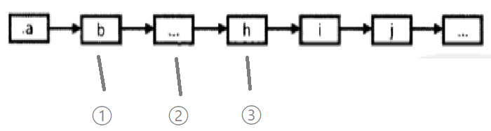
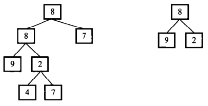

# 第 6 篇


## 链表中倒数第k个节点

### 问题
输入一个链表，输出该链表中倒数第k个结点。

### 思路
1）先扫一遍链表，获得总个数n，然后从头走n-k+1次，就得到倒数第k个了。缺点是要扫两遍
2）两个指针从开头出发，第二个指针先往后走k-1步，然后两个指针同时往后走，当第二个到达末尾时，第一个指向的就是倒数第k个

**需要注意**
head为空、k小于或等于0时，k大于链表长度时的特殊情况
需留心不要写错边界条件

### 代码
```python
class Solution:
    def FindKthToTail(self, head, k):
        if (not head) or k <= 0:
            return None
        count = 0
        pointer = head
        while(count < k and pointer):
            count += 1
            pointer = pointer.next
        if count < k:
            return None
        else:
            target = head
            while(pointer):
                target = target.next
                pointer = pointer.next
            return target
```

## 反转链表
### 问题
输入一个链表，反转链表后，输出链表的所有元素（函数返回头节点即可）。


### 分析
如下面所示，有三个指针，此时，让2的next指向1进行反转，然后指针2移动到3的位置，指针1移动到2的位置，指针3后移，继续进行反转，直到指针3指向为空时再进行最后一次反转。


更简单来说只要两个指针，交换之前，先临时开辟第3个指针指向2的下一个，然后2的next指向1，2指向3，1指向2，完成一次循环。

需注意代码鲁棒性，考虑到头节点指针为空、只有1个节点即头节点的两种特殊情况。

### 代码

```python
# -*- coding:utf-8 -*-
# class ListNode:
#     def __init__(self, x):
#         self.val = x
#         self.next = None
class Solution:
    # 返回ListNode
    def ReverseList(self, pHead):
        # 判断头节点为None或者只有头节点的特殊情况
        if not (pHead and pHead.next):
            return pHead
        a = pHead
        b = pHead.next
        # 需注意处理原来的头节点
        pHead.next = None
        while(b):
            c = b.next
            b.next = a
            a = b
            b = c
        return a
```


## 合并两个排序的链表
### 问题
输入两个单调递增的链表，输出两个链表合成后的链表，当然我们需要合成后的链表满足单调不减规则。

### 思路
两个指针指向两个链表，比较当前两个数，把较小的连到结果链上，指针后移，直到其中某个链表走完，把另一链表余下部分连到结果链末尾即可。

需要注意处理特殊输入（空）的情况。

### 代码
递归版本：
```java
//java
public ListNode Merge(ListNode list1,ListNode list2) {
       if(list1 == null){
           return list2;
       }
       if(list2 == null){
           return list1;
       }
       if(list1.val <= list2.val){
           list1.next = Merge(list1.next, list2);
           return list1;
       }else{
           list2.next = Merge(list1, list2.next);
           return list2;
       }       
   }
```

非递归版本
```java 
//java
		if(list1 == null){
            return list2;
        }
        if(list2 == null){
            return list1;
        }
        ListNode mergeHead = null;
        ListNode current = null;     
        while(list1!=null && list2!=null){
            if(list1.val <= list2.val){
                if(mergeHead == null){
                   mergeHead = current = list1;
                }else{
                   current.next = list1;
                   current = current.next;
                }
                list1 = list1.next;
            }else{
                if(mergeHead == null){
                   mergeHead = current = list2;
                }else{
                   current.next = list2;
                   current = current.next;
                }
                list2 = list2.next;
            }
        }
        if(list1 == null){
            current.next = list2;
        }else{
            current.next = list1;
        }
        return mergeHead;

```
python版本是自己写的，可以看到上一版本中，由于链表头需要单独处理，因此while中对每种情况，都单独区分了当前是链表头还是链表中间，而python版本里，新建了一个空的链表头（多开辟了一丢丢空间），使得链表头时的操作与链表中间的操作相同。

```python
# python版本
# class ListNode:
#     def __init__(self, x):
#         self.val = x
#         self.next = None
class Solution:
    # 返回合并后列表
    def Merge(self, pHead1, pHead2):
        # 判空
        if not (pHead1 or pHead2):
            return None
        elif not pHead1:
            return pHead2
        elif not pHead2:
            return pHead1
        c1 = pHead1
        c2 = pHead2
        head = ListNode(0)
        c3 = head
        while c1 and c2:
            if c1.val <= c2.val:
                c3.next = c1
                c3 = c1
                c1 = c1.next
            else:
                c3.next = c2
                c3 = c2
                c2 = c2.next
        if c1:
            c3.next = c1
        if c2:
            c3.next = c2
        return head.next
```
注意由于是链表，所以最后将余下部分直接整个链上就行，一开始很傻的写成了把剩下部分每一个节点遍历链接一遍 = =   

## 树的子结构
### 题目
输入两棵二叉树A，B，判断B是不是A的子结构。（ps：我们约定空树不是任意一个树的子结构）

### 思路



首先**遍历树1**，找到树1中与树2根节点值相等的节点，说明可能就是子结构的根。
然后检查以此节点为根的树3，是否包含树2中的结构。特别注意是3包含2，因此应当**遍历2**，看2中的结构在3中是否都有，即使3比2多，若2的结构3都有的话，也是包含。

由于树的操作比较复杂，因此很多地方需要判空，代码要写的足够完善。

### 代码
采用递归方法遍历树1，找到相同根节点后，对1的子树3，采用递归方法遍历树2并同步遍历检查子树3
```python
# -*- coding:utf-8 -*-
# class TreeNode:
#     def __init__(self, x):
#         self.val = x
#         self.left = None
#         self.right = None
class Solution:
    def __init__(self):
        self.isSub = False
    
    def HasSubtree(self, pRoot1, pRoot2):
        # 外层遍历整个树1，找到和2根节点相等的
        # 找到则进入内层，遍历2，按相同方法遍历1，判断是否结构相同
        if not pRoot2:
            return False
        self.visit_tree(pRoot1, pRoot2)
        return self.isSub
        
    def visit_tree(self, root, root2):
        if not root:
            return
        else:
            if root.val == root2.val:
                if self.check_structure(root, root2):
                    self.isSub = True
            self.visit_tree(root.left, root2)
            self.visit_tree(root.right, root2)
    
    def check_structure(self, root1, root2):
        if not root2:
            return True
        if not root1:
            return False
        else:
            if root1.val != root2.val:
                return False
            left_check = self.check_structure(root1.left, root2.left)
            right_check = self.check_structure(root1.right, root2.right)
            return left_check and right_check
```

上面是自己手写的，比较啰嗦，而且找到子树以后还有一些冗余的遍历，甚至连init都搬出来了= = ，可参照下面较简洁的代码：

```python
class Solution:
    def HasSubtree(self, pRoot1, pRoot2):
        result = False
        if pRoot1 and pRoot2:
            if pRoot1.val == pRoot2.val:
                result = self.check_structure(pRoot1, pRoot2)
            if not result:
                result = self.HasSubtree(pRoot1.left, pRoot2)
            if not result:
                result = self.HasSubtree(pRoot1.right, pRoot2)
        return result
        
    def check_structure(self, root1, root2):
        if not root2:
            return True
        if not root1:
            return False
        if root1.val != root2.val:
            return False
        left_check = self.check_structure(root1.left, root2.left)
        right_check = self.check_structure(root1.right, root2.right)
        return left_check and right_check
```


