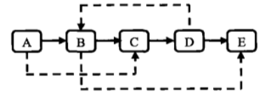
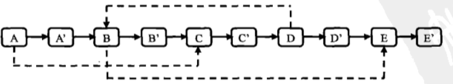
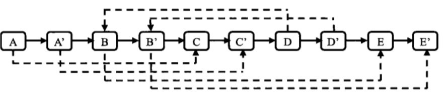
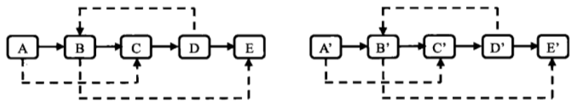
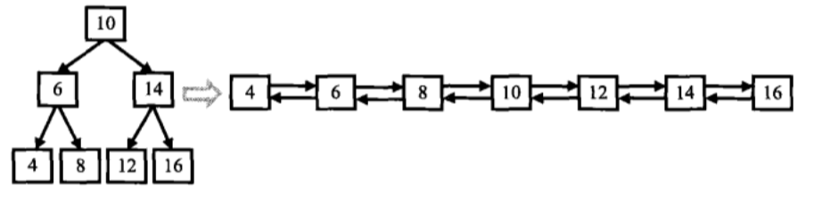
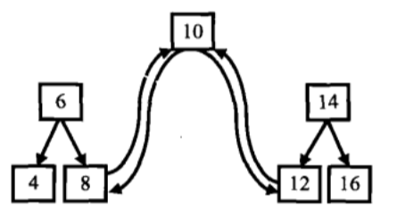
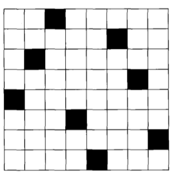

# 第 8 篇

## 复杂链表的复制

### 问题
输入一个复杂链表（每个节点中有节点值，以及两个指针，一个指向下一个节点，另一个特殊指针指向任意一个节点）。要把这个复杂链表完全复制独立的一份新链表。返回结果为复制后复杂链表的head。




### 思路
**基本思路**
两趟，第一趟按照next指针，把链表复制一遍；第二趟再处理random指针，比如说从A开始，A的random到C，数一数C在原链表中的位置，那么就在新链表里把新A位置的random指向对应的新C位置。

缺点：时间复杂度高，第二趟时每个节点都要从头找一遍，复杂度O(n^2)

**改进思路：空间换时间**
既然上面第二趟要挨个找，那不如直接第一趟的时候就记录下新旧节点的地址（引用）的对应关系。
第二趟时，比如说从A开始，A的random指向C的引用，查表，就能立马得到新C的引用，将新C的引用直接赋给新A的random就行。

时间复杂度仍为O(n)，而且代码简单，易于操作。缺点是多加了n的空间消耗。

**变态思路：不用额外空间，时间复杂度仍O(n)**
在新建链表时，做成这种形式，第一步，将新链表的节点接到对应的旧节点的后面


第二步，复制指针。比如说A指向C，那么A的next是A'，就指向C的next是C'。




第三步，拆分链表，恢复到新旧两个表。奇数位置的连起来就是原链表，偶数位置的连起来就是新链表。



这种方法虽然遍历了三趟，时间复杂度计算仍是O(n)，而且未占用额外空间。缺点就是思路不是很容易想到，而且写的代码要复杂一些。

### 代码
这一段是按照思路2来写的。
```python
# -*- coding:utf-8 -*-
# class RandomListNode:
#     def __init__(self, x):
#         self.label = x
#         self.next = None
#         self.random = None
class Solution:
    # 返回 RandomListNode
    def Clone(self, pHead):
        # 按照思路2来写的
        if not pHead:
            return None
        nHead = RandomListNode(pHead.label)
        pCurrent = pHead.next
        nCurrent = nHead
        # 初始化映射
        mapper = {}
        # 需要注意，要特别添加一个None到None的映射！！
        mapper[id(pHead)] = nHead
        mapper[id(None)] = None
        # 原样复制链表
        while(pCurrent):
            node = RandomListNode(pCurrent.label)
            nCurrent.next = node
            nCurrent = node
            mapper[id(pCurrent)] = node
            pCurrent = pCurrent.next
        # 添加random指针
        pCurrent = pHead
        nCurrent = nHead
        while(pCurrent):
            nCurrent.random = mapper[id(pCurrent.random)]
            pCurrent = pCurrent.next
            nCurrent = nCurrent.next
        return nHead
```


## 二叉搜索树与双向链表

### 问题
输入一棵二叉搜索树，将该二叉搜索树转换成一个排序的双向链表。要求不能创建任何新的结点，只能调整树中结点指针的指向。

### 思路
分析此问题，建议方法是画出一个二叉搜索树，然后手推一遍转换，从手推的过程中，发现如何程序化地做这道题。



直观来看，对二叉搜索树，做中序遍历即可按照从小到大的顺序来输出，可以用递归的方式来简便地写出中序遍历，这个过程，相当于把大树做了分解，分成根节点、左子树和右子树来处理。在遍历过程中，需要适时修改指针，完成向链表的转换。



手推一遍转换，大概可以总结出如下步骤：

- 拿到一棵子树
- 如果它有左子树，则递归左子树。同时，需考虑到连接指针的问题，根节点要和左子树的最大节点进行连接，所以递归需要返回左子树**最大节点**，根节点与它双向连接。
- 如果它有右子树，则递归右子树。同时，需考虑到连接指针的问题，根节点要和右子树的最大节点连接，所以递归需要返回右子树**最小节点**，根节点与它双向连接。但这样就会导致左右子树的递归函数不同，额外造成很多麻烦，考虑到递归返回时，子树已经转换成双向链表了，因此右子树也返回**最大节点**，然后一直往左找到其最小，连接到根上即可。这样左右子树递归的函数可以同样的方法来处理。
- return返回值。根据上面的叙述，递归函数返回的是该子树中的最大值，如果有右子树，则返回右子树的最大值即可，如果没有右子树，则根节点最大，返回根节点的值。

按照上面步骤，写成代码如下。

另外的一种做法是，可以中序遍历，遍历到根节点时将根节点加入一个list里面，然后从头到尾访问一遍list，把前后相邻元素的指针互相修改指一下就可以。缺点是开辟了额外的一个list的一丢丢空间（但是没有创建新的树的节点嘛），优点是思路好想，不容易出错，而且没有多次一直向左寻找最小值的操作。

### 代码
```python
# -*- coding:utf-8 -*-
# class TreeNode:
#     def __init__(self, x):
#         self.val = x
#         self.left = None
#         self.right = None
class Solution:
    def Convert(self, pRootOfTree):
        if not pRootOfTree:
            return None
        newRoot = self.visit(pRootOfTree)
        # 注意这里：递归返回的是整个双向链表的最大值节点，题目要求返回头节点（最小值）
        while(newRoot.left):
            newRoot = newRoot.left
        return newRoot
        
    # 递归遍历    
    def visit(self, root):
        right_max = None
        if not root:
            return None
        # 先递归左子树
        if root.left:
            # 递归左子树，返回值是左子树的最大节点
            left = self.visit(root.left)
            # 修改根节点和left的指向
            left.right = root
            root.left = left
        # 再递归右子树
        if root.right:
            # 递归右子树，返回值是右子树的最大节点
            right = self.visit(root.right)
            # 向左寻找最小值之前，先记下最大值，后面return要用
            right_max = right
            # 修改根节点和right的指向
            while(right.left):
                right = right.left
            right.left = root
            root.right = right
        # 返回最大值
        if right_max:
            return right_max
        else:
            return root
        
```


## 字符串的排列

### 问题
输入一个字符串,按字典序打印出该字符串中字符的所有排列。例如输入字符串abc,则打印出由字符a,b,c所能排列出来的所有字符串abc,acb,bac,bca,cab和cba。

输入描述:
输入一个字符串,长度不超过9(可能有字符重复),字符只包括大小写字母。

### 思路
这相当于一个排列组合的问题。以abc为例，思考一下如果人工做这个题的思路。首先是固定首位为a，那么剩下bc，第二位若排b，第三位则排c，否则二c三b，所以可以排出abc，acb。然后首位为b，剩下ac，可以排出bac，bca。然后首位为c，剩下ab，可以排出cab，cba。

整体思路应该是，先固定首位，然后余下的部分做排列；余下部分固定首位，再余下做排列……是一种递归的思路。

思路还可以，实现的时候要想清楚细节。

在具体实现中，固定首位取余下，代码方面可以这样做：字符串的首位依次与后边交换，比如说 abc，首位a先与它自己a换，即abc，然后递归bc；首位a再与b换，即bac，然后递归ac（递归后，记得再换回去）；首位a再与c换，得到cba，然后递归ba……

因为题目要求字典序打印，而且输入中会有重复字符，所以对最终得到的list要做去重，然后字典序排序。

### 代码
```python
class Solution:
    def __init__(self):
        self.result = []
    
    def Permutation(self, ss):
        if not ss:
            return []
        # python 不可直接修改string，先变成char数组
        chars = list(ss)
        # 开始递归
        self.permute(chars, 0)
        # 最终结果去重、排序
        res = list(set(self.result))
        res.sort()
        return res
        
    def permute(self, string, begin):、
    	# 已经递归到底了
        if begin == len(string):
            self.result.append(''.join(string))
        else:
        	# 轮番从各个位置的char中选一个当作首位，交换位置
            for i in range(begin, len(string)):
                string[i], string[begin] = string[begin], string[i]
                # 固定首位，递归余下的
                self.permute(string, begin+1)
                # 记得换回去
                string[i], string[begin] = string[begin], string[i]
```

### 扩展

（1）如果不是排列，而是组合问题呢？例如abc的组合有a，b，c，ab，ac，bc，abc
是否仍然可用递归的方法？

（2）给定8个数字，判断有没有可能把8个数字放到正方体8个顶点上，使得正方体三组相对的面上的4个顶点的和相等。

思路：得到8个数字的各种排列，逐个判断是否符合条件

（3）**八皇后问题**
8x8棋盘上摆放8个棋子，使其不能互相攻击（任意两个棋子不得放在同一行、同一列、同一对角线）




【一种思路】

首先8个皇后不能有任意两个在同一行，肯定每个皇后一行，所以我们定义一个数组arr[8]，数组的下标为每个皇后所在行，值为该皇后所在列。所以这个数组就能唯一确定一个棋局了。

由于8个皇后也不能有任意两个在同一列，肯定每个 一列，所以数组arr[8]中的元素可以用0-7来填充，相当于对0-7数字进行全排列。也就是说，问题到这里就变成了求0-7这8个数字的全排列。

上述已满足行列的限制，对于全排列中的每种方式，再判断是否对角线即可，也就是说对每种棋局，要判断任意两个下标i和j，不得有 i-j=arr[i]-arr[j] 或者 j-i=arr[i]-arr[j]。

【其他思路】

模拟8x8棋盘，在初始棋盘的任何位置，都可以先放一个棋子，然后标记它的控制范围，再在余下的可行位置放置一个棋子，标记控制范围，依此递归下去。
缺点是要判断的次数太多了。不如第一种思路好。


【关键词】
八皇后、回溯法、排列组合、递归


