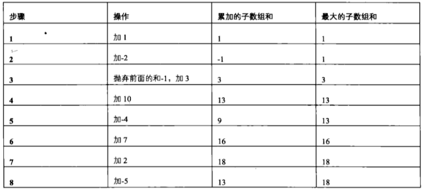

# 第 9 篇

## 数组中出现次数超过一半的数字

### 题目
数组中有一个数字出现的次数超过数组长度的一半，请找出这个数字。例如输入一个长度为9的数组{1,2,3,2,2,2,5,4,2}。由于数字2在数组中出现了5次，超过数组长度的一半，因此输出2。如果不存在则输出0。

### 思路
（1）基本思路
直观的思路就是拿空间换时间，用一个字典记录下出现的字符和次数，最后找出最大；另外思路是先把数组排序，那么中间的数字应当是要找的，检查一下它的出现次数是否真的超过长度的一半就行。第一种方法占了很多额外空间，第二种方法时间复杂度是O(nlogn)-由排序决定。

（2）较好思路
有没有时间复杂度为O(n)的方法呢？“多数投票问题，可以利用 Boyer-Moore Majority Vote Algorithm 来解决这个问题，使得时间复杂度为 O(N)。”。关于这种算法的思想，介绍如下。（ref: https://www.jianshu.com/p/dfd676b71ef0)

直观理解，该方法的思路就是，让数组中不同的元素两两抵消，最后只剩下同一种元素。如果是两个非主要元素抵消了，那么主要元素的地位得到了巩固；就算是一个主要元素和一个非主要元素抵消了，由于目标出现的次数超过数组长度的一半，所以就算是主要元素挨个与其他元素抵消，最后剩下的也肯定是主要元素。

但是这种抵消的方法，人工做起来很快，写成代码从数组里增增减减就比较麻烦。此时可以采用一种计数的方法。规则是，记下一个数字target和一个count。遍历数组，当遍历到下一个元素next时，如果和当前记下的数字target相同，那么count+1，如果不同，count-1（相当于两个抵消了）。如果在遍历到下一个元素next之前，count已经被减为0了，则说明之前的抵消干净了，此时应当将target设置为next，count记为1。仔细想一下，这种方法就是模拟了不同的元素两两抵消。所以最后一个使count设为1的元素，战胜了其他所有元素，它就是出现次数多于一半的目标。

需要注意：上面的前提是目标一定存在。如果目标不存在，比如[1,2,3,3,4]，使count最后一次被设置为1时的元素是3，但3出现的次数小于一半。所以最终还要再遍历一遍，判断一下找到的元素是否个数真的多于一半。

### 代码
```python
# -*- coding:utf-8 -*-
class Solution:
    def MoreThanHalfNum_Solution(self, numbers):
        if not numbers:
            return 0
        target = numbers[0]
        count = 1
        for i in range(1, len(numbers)):
            if count == 0:
                target = numbers[i]
                count = 1
            elif target == numbers[i]:
                count += 1
            elif target != numbers[i]:
                count -= 1
        # count==0说明刚好消干净了，没有个数多于一半的，就不用再数了直接返回0
        if count == 0:
            return 0
        count = 0
        for i in range(0, len(numbers)):
            if numbers[i] == target:
                count += 1
        if count > len(numbers)/2:
            return target
        else:
            return 0
```

### 另外思路：Partition的递归方法 
复杂度也是O(n)。之前的分析提到，如果数组已经排好序，那么位于n/2位置的数字，就是要找到的数字。（如果数组不一定有解的话，再检查一遍n/2位置数字出现的次数是否满足多于一半的要求即可）。

但其实，不一定非要排好序，也能找到位于中间的数字。借鉴了快速排序的思路，在随机快速排序中，先随机取一个数，比它小的移到它左边，比它大的移到它右边。如果移动之后该数字的下标是n/2说明它就是中间的，如果大于n/2说明中位数在它左边，如果小于n/2说明中位数在它右边，递归继续找就行。最后找到了应当位于n/2位置的数，再数一遍检查是否满足要求即可。

值得一提的是，这种思路修改了原来的数组内容。


## 最小的K个数

### 问题
输入n个整数，找出其中最小的K个数。例如输入4,5,1,6,2,7,3,8这8个数字，则最小的4个数字是1,2,3,4。

### 思路
（1）基本思路
最直接的还是排序，排完直接就能取到。时间复杂度依赖于排序的时间复杂度。

（2）Partition的思路【推荐】
此外，还可使用之前Partition的思想，不过这次找的是下标为k-1的（也就是第k个数）。先随便找一个，比它小的移到左边，比它大的移到右边，然后看它的下标是否为k-1，如果是就找到了，它左边的就是最小的4个，如果小于k-1则把它 右边的递归，如果大于k-1则把它左边的递归去找k-1。这种思路修改了原来的数组内容。

（3）冒泡思路
类似冒泡排序的方法，只不过由于要找最小的4个，从右往左冒泡，只要冒四次就可以了，不用全部冒完。正常冒泡排序的复杂度是O(n^2)。

（4）堆的思路【推荐】
另一种比较容易想的思路是，找个小本本记下当前遇到的最小的四个数，把所有数找一遍，遇到新的数时就和小本本上的做比较，更新小本本，把整个数据走一遍，就找到最小的四个数了。

因此整个原数组只需过一遍，但这时重点转移在了如何构建这个小本本，实现快速查找和更新（判断当前数应不应该插入，插入在哪里）。这时就可以引入堆树（一种完全二叉树，见 https://blog.csdn.net/guoweimelon/article/details/50904346）。

由于我们要找最小的k个，因此可以采用最大堆，根节点的值总是大于任何一个子节点，这样当遇到新的数时，只需看一下它和根节点的大小，O(1)就能判断是否需要更新这个堆，如果需要更新的话，则需要O(logk)来找到要插入的位置。每个数字都需要经过这一步骤，因此时间复杂度为O(nlogk)（这里的log都以2为底）。

堆的解法虽然时间复杂度大，但好处在于没有修改原输入数据，而且适合海量数据的场景。只要k不是很大，只需在内存中维护这个小本本就行，哪怕原始输入非常大无法放入内存，也只需从磁盘中读一遍，完全能处理得过来。

### 代码
偷懒一下，这里写了一个冒泡的代码。
```python
class Solution:
    def GetLeastNumbers_Solution(self, tinput, k):
        if not tinput:
            return []
        # 注意：要处理当k值比输入的数组长度还长时的报错
        if len(tinput) < k:
            return []
        for i in range(0, k):
            for j in range(len(tinput)-1, i, -1):
                if tinput[j] <  tinput[i]:
                    tinput[j], tinput[i] = tinput[i], tinput[j]
        return tinput[:k]
```

堆和各种排序的，后面抽出时间专门整理一下排序相关的算法吧。


## 连续子数组的最大和

### 问题
一个整型数组（有正数也有负数），数组中一个或连续多个的元素组成子数组，找出子数组的最大和。要求时间复杂度O(n)。

例如，[1,-2,3,10,-4,7,2,-5]其中和最大的子数组是[3,10,-4,7,2]，因此输出18。

### 思路
（1）最笨的方法，枚举所有子数组然后找最大，这种方法相当于一个组合问题，复杂度O(n^2)肯定不行。

（2）举例来模拟判断过程，寻找判断规律。

记下两个数字：当前的累加和A，以及当前出现过的最大的和B。
A=0，B=0.
从1开始，先加1，A=B=1。
再加-2，A=-1，B=1.
再加3， A=2,而如果抛弃历史加和，A=3，比带历史包袱的情况下要高，所以果断抛弃历史，A=B=3.
再加10， A=B=13
再加-4，A=9， B=13
再加7， A=16，B=16
再加2，A=18， B=18
再加-5，A=13， B=18
所以最后得到最大和为18.

整理一套判断思路是，获得一个数，看A如果小于0，说明此时历史带来的是负面影响，直接抛弃历史，将A更新为当前数；如果A大于0，则A加上当前数。更新A之后，如果A大于B则更新B，否则继续读下一个数。（注意：A<0抛弃历史，A可以更新为当前数，但B不可以直接更新，因为B记录的是历史最大值）


### 代码
```python
# -*- coding:utf-8 -*-
import sys

class Solution:
    def FindGreatestSumOfSubArray(self, array):
        # write code here
        if not array:
            return 0
        current_sum = sys.maxsize * -1
        max_sum = current_sum
        for i in array:
            if current_sum < 0:
                current_sum = i
            else:
                current_sum += i
            if current_sum > max_sum:
                max_sum = current_sum
        return max_sum        
```

注意的地方：1，判断输入是否有效；2，一开始的时候将current_sum和max_sum设为0，但当整个数组的和最大值是负数的时候，上述设置按照代码的逻辑max_sum一直得不到更新就出现了问题。

## 从1到n整数中1出现的次数

### 问题
给定n，求1到n的整数中1这个字符出现的次数。例如n=13，1~13中包含1的数字有1、10、11、12、13，因此字符1共出现6次.

### 思路
最笨的每个数字去判断的方法肯定不行，太复杂。可以从分析数字的规律入手。

先以个位数字为例，每0-9中，个位上就会出现1个1。
以十位数字为例，每0-99中，十位上就会出现10个1。
以百位数字为例，每0-999中，百位上就会出现100个1。
以千位数字为例，每0-9999中，千位上就会出现1000个1。
按照如上规律，可以从个位开始，逐个分析每一位上能出现的1的个数，加总起来就可以了。

有很需要注意的细节问题。

例如1133中，1133/10是113，但实际上由于个位是3，0-3相当于也能凑够一个0-9，所以应当是114个个位的1。

同理，1133中，要考虑十位上的1的个数，1133/100是11，但由于十位是3，0-3相当于0-9，所以有12x10个十位的1。

如果数字是1113，要考虑十位上1的个数呢？情况变得更加复杂，因为1133能凑够12个100，但1113只能凑够11个整的100，余下的13，其十位上也有一个1，所以就是11个整的一百x每一百就有10个十位上的一，外加单独13中的4个十位上的1。

如果数字是1103呢？那就只有11个整的100，余下的03十位上没有1。

综合以上的叙述，大概形成下面的代码。虽然代码看起来只有几行，但道理比较难想通。举个例子按代码跑一遍就能好理解一些。以n=113为例。

m=1, a=113, b=0, a+8=121, (a+8)/10 = 12, 12x1=12. a%10=3,所以由于这个3中包含的1已经在前面a+8里考虑进去了，所以不再管了。

m=10, a=11, b=3, a+8=19, (a+8)/10=1（此时113中只考虑了0-99，而100-113中的十位的1没有考虑进去），1x10=10. a%10=1,所以单独拎出来考虑100-113，这当中的十位上有多少个1呢，从110-113，有4个十位上的1，所以b+1=4。

m=100, a=1, b=13, a+8=9, (a+8)/10=0 （所以此时并没有凑够0-999），而由于 a%10=1，所以单独考虑100-113的百位上的1，数量为13+1=14。

（真复杂啊呵呵）

### 代码
```python
class Solution:
    def NumberOf1Between1AndN_Solution(self, n):
        ones = 0
        m = 1
        while m <= n:
            a = n // m
            b = n % m
            ones += (a + 8) / 10 * m + (a % 10 == 1) * (b + 1)
            m *= 10
        return ones
```

## 把数组排成最小的数

### 问题
输入一个正整数数组，把数组里所有数字拼接起来排成一个数，打印能拼接出的所有数字中最小的一个。例如输入数组{3，32，321}，则打印出这三个数字能排成的最小数字为321323。

### 思路
最笨的方法：对数组的元素进行全排列，比较各个结果的大小。

这里需要注意一些问题：将多个数字拼接起来，可能会导致超出某些语言里面int的最大范围；全排列的话非常慢，而且将两个整数用数学的方法拼起来也需要一些处理过程。

既然是数字拼接，可以先将数字转成字符串，拼接之后再转回数字，就能很快实现拼接了。进而思考，像题中的例子，3，32，321的拼接规则是：先看高位，高位选最小的；如果高位一样，再看第二位，选最小的，依此类推。也就是说，似乎将数字转为字符串，然后字符串排序一下，拼出来的就是满足要求的结果了。

但是需注意：默认字符串字典排序中，3和32，应当是32更大，但显然这里应当将32排在前面，因为323和332相比显然323更小。所以需要自定义一个排序的方法。Java中可以重写Comparator，Python中也可以自定义排序的方法。下面代码中的这种自定义的排序方法很骚气，完全面向要实现的目标，而且简洁易懂，没有复杂的各种规则。

剑指Offer书中还对这种排序的规则和这种字符串排序拼接方法的正确性进行了论证，详可参考书籍。

### 代码
```python
# -*- coding:utf-8 -*-
class Solution:
    def PrintMinNumber(self, numbers):
        if not numbers:
            return ""
        str_list = [str(n) for n in numbers]
        # python中，sort可以传入自定义的排序方法
        str_list.sort(self.Sort)
        return int(''.join(str_list))
    
    def Sort(self, x, y):
    	# 如何判断3和32谁应该排在前面呢？
        # 只要将他俩正反拼接一下，就知道了！这个排序的比较方法很骚气，完全不需要定义什么复杂的字典序规则！
        left = x + y
        right = y + x
        if left > right:
            return 1
        else:
            return -1
```


------

本文稿来自 https://github.com/dox1994/offer-coding-interviews-python，欢迎前来给个star🌟～ 如有错误或遗漏欢迎issue～